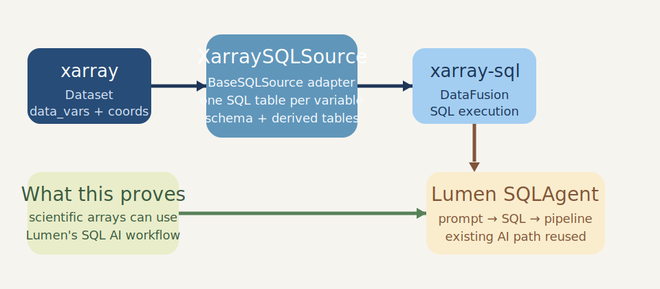

# Xarray SQL Bridge for Lumen AI

Prototype repository for exposing `xarray.Dataset` objects through Lumen's existing SQL AI path.

[](https://github.com/SanketMeghale/lumen-xarray-sql-bridge/actions/workflows/tests.yml)



## Proposal Summary

Lumen's AI workflow already knows how to reason about `BaseSQLSource` implementations. Scientific data, however, often arrives as `xarray.Dataset` instead of a database table. This prototype follows the maintainer direction of building on `BaseSQLSource` and [`xarray-sql`](https://github.com/alxmrs/xarray-sql) so AI can write transforms through the existing SQL path instead of relying on a separate xarray-specific transform system.

The core adapter is `XarraySQLSource`, a `BaseSQLSource` implementation backed by `xarray-sql` and DataFusion.

## Why this stands out

- Reuses Lumen's existing SQL agent instead of introducing a parallel AI transform system
- Exposes each xarray `data_var` as its own SQL table, which preserves mixed-dimensional datasets
- Supports schema discovery, SQL execution, and derived SQL-backed tables
- Demonstrates a practical bridge between tabular AI workflows and scientific array data

## Key design decision

The prototype registers one SQL table per xarray variable.

That decision matters because real datasets often mix variables with different dimensions. Flattening the whole dataset into a single SQL shape would either fail or distort the data model. Per-variable registration stays compatible with `xarray-sql` while matching Lumen's existing logical table abstraction.

## What works

- `SELECT * ... LIMIT 5` style previews
- filtering on dimension coordinates such as `time`, `lat`, and `lon`
- grouping, sorting, aggregates, and derived queries
- SQL-backed derived tables via `create_sql_expr_source(...)`
- AI compatibility with Lumen's `SQLAgent` path

## What this does not claim

- not every natural-language prompt will work
- not every backend SQL feature is guaranteed to match DuckDB exactly
- not every xarray-native scientific transform belongs naturally in SQL
- not all auxiliary or non-dimension coordinates are modeled as first-class SQL columns

## Quick proof

Local demo query:

```text
Tables: ['temperature']

Top 5 rows
        time   lat   lon  temperature
0 2024-01-01  10.0  70.0          1.0
1 2024-01-01  10.0  80.0          2.0
2 2024-01-01  20.0  70.0          3.0
3 2024-01-01  20.0  80.0          4.0
4 2024-02-01  10.0  70.0          5.0
```

This repository is meant to demonstrate architectural feasibility, not production completeness.

## Install

```bash
python -m venv .venv
.venv\Scripts\activate
pip install -e .[test]
```

## Run

Local demo:

```bash
python scripts/demo.py
```

Run tests:

```bash
pytest -q
```

Optional live AI demo:

```bash
set OPENAI_API_KEY=...
python scripts/live_sql_agent_demo.py
```

## Repository layout

- `src/lumen_xarray_sql_prototype/source.py`: prototype `XarraySQLSource`
- `scripts/demo.py`: local query demo without an LLM
- `scripts/live_sql_agent_demo.py`: live SQL-agent demo once credentials are available
- `tests/test_source.py`: focused source and AI-path proof tests
- `PR_NOTES.md`: proposal and PR rationale kept out of code docstrings

## Current status

- standalone prototype package
- local demo passes
- focused tests pass
- GitHub Actions test workflow included

## Next hardening steps

- validate against live model output under a configured provider
- broaden prompt coverage for more complex scientific prompts
- add more explicit handling for auxiliary coordinates and backend dialect edge cases
